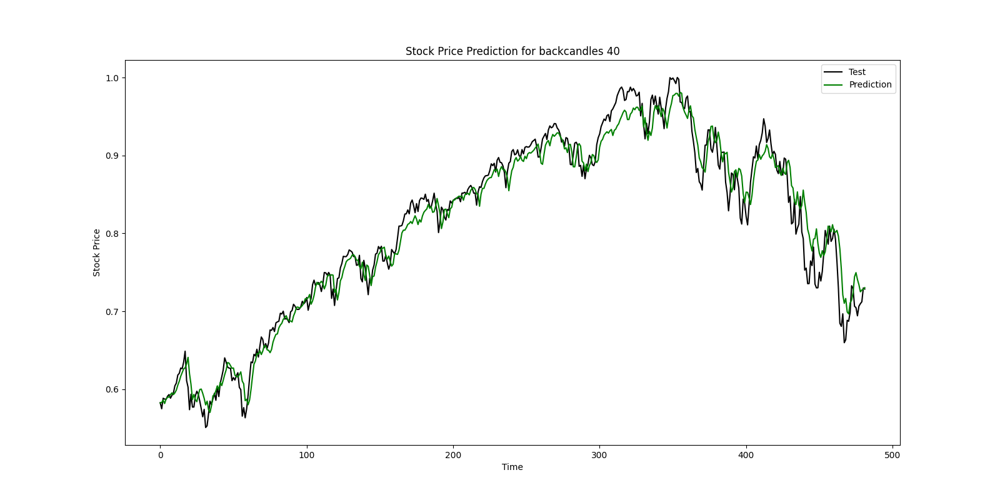
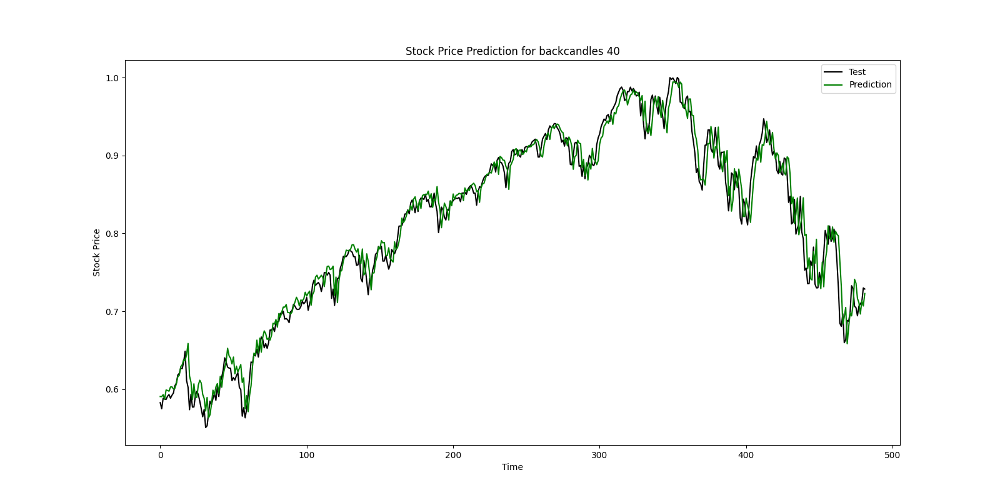

# **Stock Market Prediction**

### ****Overview****

This project aims to predict future stock market prices using Long Short-Term Memory (LSTM) networks, a type of recurrent neural network (RNN) particularly well-suited for sequence prediction problems. The model leverages historical stock price data along with various technical indicators to forecast the next day's closing price.

### Features

Data Loading: Fetches historical stock price data from Yahoo Finance.
Technical Indicators: Calculates various technical indicators such as RSI, EMA, SMA, MACD, Bollinger Bands, and more.
Data Preprocessing: Normalizes data and prepares feature and target sets for model training.
Feature Selection: Uses Recursive Feature Elimination (RFE) to select important features.
LSTM Model: Constructs and trains an LSTM model for stock price prediction.
Evaluation: Evaluates model performance using metrics like Mean Squared Error (MSE), Mean Absolute Error (MAE), Root Mean Squared Error (RMSE), and R-squared (R²) score.
Visualization: Plots predicted vs. actual stock prices for visual evaluation.

### Installation


#### Clone the repository:
```
git clone https://github.com/your-username/your-repo.git
cd your-repo
```

#### Install the required packages:
```
pip install -r requirements.txt
```

#### Run the Script:
```
python main.py
```

### Results

Accuracy with all features and `backcandles=40`:\
`0.9647755068389264`
* Open 
* High
* Low
* Adj Close
* RSI
* EMAF 
* EMAM 
* EMAS 
* SMA
* PSL
* ROC
* FWMA 
* entropy
* zscore
* macd
* bb




Accuracy with chosen features and `backcandles=40`:

`0.9734639022357808`

* Open 
* High
* Low
* Adj Close
* EMAF
* EMAM
* EMAS
* SMA
* FWMA


